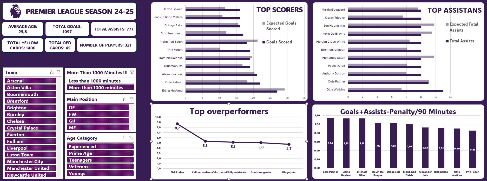

# Premier League Player Performance Analysis

Excel dashboard analyzing Premier League player performance during the 2024–2025 season.

## Tools
- Microsoft Excel
- Pivot Tables
- Pivot Charts
- Slicers
- Calculated Columns

## Dataset
The dataset contains detailed statistics for Premier League players including:

- Matches played
- Minutes played
- Goals and assists
- Expected goals (xG)
- Expected assists (xAG)
- Progressive actions
- Cards (yellow/red)
- Team and position information

## Dashboard Features
- Interactive filters (Team, Position, Age category, Minutes played)
- KPI metrics (Average age, Total goals, Total assists, Cards, Number of players)
- Top scorers vs expected goals comparison
- Top assist providers vs expected assists
- Player efficiency metrics per 90 minutes
- Overperformance analysis (Goals vs Expected Goals)

## Files
- `Premier-League-Dashboard.xlsx` – Excel dashboard
- `players.csv` – dataset
- `premier-league-dashboard.png` – dashboard preview

## Dashboard Preview

